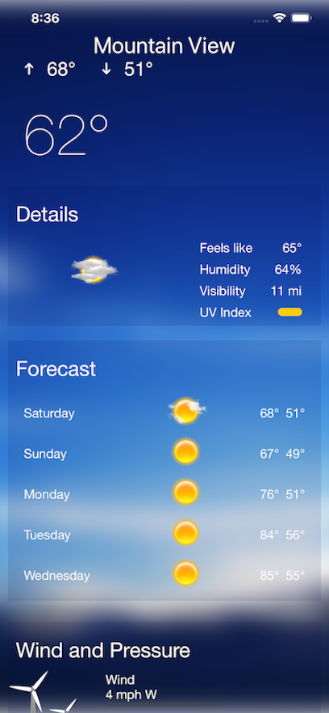

# WeatherSwiftUI

WeatherSwiftUI is an iOS weather app whose UI is similar to parts of the Yahoo! Weather app. It uses Combine to download and update weather info from AccuWeather and illustrates a fairly simple case of using zip to pair the two async weather calls. AccuWeather requires that you get an API key, but it is free for low-use apps. There are links for this in ViewModel+Network.swift.

|

## License

WeatherSwiftUI is licensed under the MIT License. See the LICENSE file for more information, but basically this is sample code and you can do whatever you want with it.